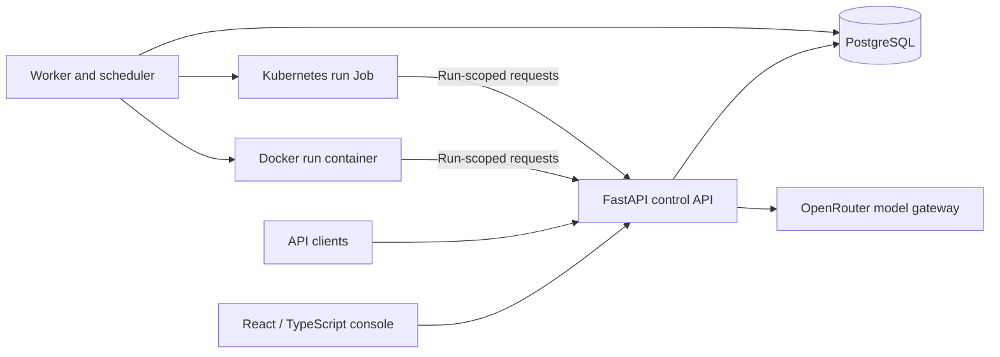

# Agentberth

**A platform for running tool-equipped AI agents behind an API.**

Agentberth brings agent configuration, isolated execution, task scheduling, and file processing into one application. Define an agent through the web console or API, equip it with versioned tools, and submit tasks to a persistent queue. Each run receives its own execution environment and temporary workspace, with a recorded history of model calls, tool activity, and generated artifacts.

Run the platform with Docker Compose or deploy it to Kubernetes with Helm. Both deployment modes use the same console, API, tool packages, and agent runtime.

**Project status:** functional preview for development and evaluation by a single trusted administrator. Docker and Kubernetes execution are implemented; multi-tenant authorization, high availability, and microVM execution remain outside the current release. See the [security model](docs/security.md) and [roadmap](docs/roadmap.md) for scope and limitations.

## Philosophy

Agentberth is built on the belief that you should own your data and control the software that processes it. Convenience should not come at the expense of that control. These principles guide both the implementation and the project's direction.

**Data retention should be a deliberate choice.** Data should be kept because it serves a purpose you have chosen, rather than simply because storage is available. Uploaded input files are scoped to a single task and expire when that task reaches a terminal state. Outputs and run records currently persist; planned retention controls will allow results to expire after a configurable period or be removed after a successful download. Input-file expiry does not remove information reproduced in prompts, tool events, or results, so retention needs to address the full lifecycle of a task.

**Self-hosting should be a first-class option.** You should be able to run the platform on infrastructure you control, inspect how it works, and adapt it to your needs. Agentberth supports Docker Compose and Kubernetes so that its operation is not tied to a particular hosting provider. Managed cloud infrastructure is a valid choice when it is useful; the important part is that the choice remains yours.

**Model choice should include local AI.** Running your own models can provide greater control over privacy, availability, and cost. Support for local inference through tools such as Ollama and LM Studio is planned. The current implementation uses OpenRouter for LLM inference, which sends prompts and tool results to external providers; self-hosting the application does not yet make model inference local. The deterministic demonstration runs without a model service.

**Open source should make that control practical.** Access to source code matters most when people can understand, run, modify, and build on it. Documented APIs, portable tool packages, reproducible examples, and clear setup instructions are core parts of the project. The aim is to give users and contributors the means to maintain their own deployments and shape the software around their needs.

## Capabilities

- **Agent APIs:** configure instructions, model settings, and tools; invoke agents through authenticated endpoints with idempotent submission support.
- **Isolated execution:** run each task in a dedicated Docker container or Kubernetes Job with resource limits, execution deadlines, and automatic cleanup.
- **Versioned tools:** author Python tool packages, validate them in a sandbox, publish immutable versions, and select tools per agent or per run.
- **Persistent scheduling:** queue tasks, schedule one-time or fixed-interval runs, and pause, resume, or delete schedules through the console or API.
- **File workflows:** attach files or ZIP/TAR archives, process them in an ephemeral workspace, and download outputs individually or as a combined ZIP.
- **Execution visibility:** inspect persisted events, stream progress with server-sent events, review token usage and reported cost, and cancel pending or running tasks.
- **Reproducible examples:** start with a deterministic demonstration without model credentials, then explore multi-step OpenRouter agents for data analysis and planning.

## Quick start

**Requirements:** Docker with Compose v2 or later, configured to run Linux containers. Docker Desktop supports the macOS setup. The initial demonstration requires no model API key or additional language runtimes.

From the repository root:

```bash
cp .env.example .env
docker compose up --build -d
```

If `.env` already exists, retain your configuration instead of copying over it.

Open [http://localhost:8080](http://localhost:8080), select **Harbor guide**, and choose **Run agent**. The demonstration executes Python and creates `report.md`; inspect the activity stream and download the report from **Result**. This provider runs a fixed workflow so the installation can be verified without an LLM call.

The Compose configuration binds the console to the loopback interface. Its development administration key is `agentberth-local`; set `AGENTBERTH_ADMIN_KEY` in `.env` to use a custom key, then enter that key in the console. The public development key is not suitable for shared access.

To stop the application while retaining its database and artifacts:

```bash
docker compose down
```

## OpenRouter examples

Set `LLM_API_KEY` in `.env` and configure `LLM_MODEL` with an OpenRouter model ID that supports tool calling. The supported provider endpoint is `https://openrouter.ai/api/v1`. Apply the configuration with:

```bash
docker compose up -d
```

The console includes three agents with distinct suggested tasks:

| Agent | Workflow | Deliverables |
| --- | --- | --- |
| **Sales data auditor** | Validate CSV data, remove duplicate and invalid rows, account for refunds, and verify regional totals | Cleaned CSV, JSON summary, audit report |
| **Project dependency planner** | Validate dependencies, calculate a critical path, and assess the effect of a delayed task | Schedule CSV, calculation checks, plan with dependency diagram |
| **Release notes editor** | Turn engineering notes into release notes while distinguishing shipped features from future plans | Release notes and QA checklist |

Select an agent to load its task. Prompts, instructions, tools, and generation limits are editable. A blank agent-level model setting uses the deployment's `LLM_MODEL`.

Provider credentials remain in the API service; sandboxes receive short-lived run tokens. OpenRouter calls incur provider charges. See [example workflows and live verification](docs/examples.md) for expected outputs and a runnable validation script.

## API usage

Submit a task to the demonstration agent:

```bash
curl --fail-with-body http://localhost:8080/v1/deployments/harbor-guide/runs \
  -H 'Authorization: Bearer agentberth-local' \
  -H 'Content-Type: application/json' \
  -H 'Idempotency-Key: first-demo-run' \
  -d '{"input":"Create a demonstration report."}'
```

The API returns **202 Accepted** with the run ID, status URL, and event-stream URL. Replace `RUN_ID` with the returned ID to inspect the result or stream progress:

```bash
curl --fail-with-body http://localhost:8080/v1/runs/RUN_ID \
  -H 'Authorization: Bearer agentberth-local'

curl --no-buffer http://localhost:8080/v1/runs/RUN_ID/events \
  -H 'Authorization: Bearer agentberth-local'
```

Use your configured administration key when it differs from the development key. The [API guide](docs/api.md) covers agent management, tools, scheduling, file uploads, and artifact downloads. A running deployment exposes its [OpenAPI schema](http://localhost:8080/openapi.json).

## Architecture



The API manages configuration, authentication, tool registration, and the model gateway. PostgreSQL stores the queue, schedules, immutable run snapshots, events, and artifacts. A separate worker evaluates schedules and executes one queued task at a time through the selected backend.

Agent and tool configuration is captured when a run is accepted; schedules retain their own configuration snapshots. Later edits do not change work already accepted. Uploaded input bytes expire when a run reaches a terminal state, while run metadata and generated artifacts remain available.

The worker manages Docker through its socket or Kubernetes through a scoped service account. Run environments receive neither the Docker socket nor database or provider credentials. Container isolation and network controls are described in the [architecture](docs/architecture.md) and [security documentation](docs/security.md); they are not a guarantee of safe execution for arbitrary untrusted workloads.

## Deployment options

| Deployment | Execution backend | Setup |
| --- | --- | --- |
| Docker Compose | One Docker container per run | [Quick start](#quick-start) |
| Kubernetes with Helm | One Kubernetes Job per run | [Installation and operations guide](docs/kubernetes.md) |

The Kubernetes guide covers registry configuration, credentials, storage, network policies, upgrades, and access through port-forwarding. It includes DigitalOcean, kind, and MicroK8s configurations; the [validation record](docs/validation.md) identifies which environments have been tested.

Deployments are independent: each maintains its own agents, tool registry, schedules, database, and run history. MicroVM-backed execution is a future extension, not a requirement for either supported deployment mode.

## Extending the platform

Tools use a repository-friendly package format: `tool.json`, `handler.py`, and `tests.json`. Bundled tools reside in `tools/builtin`. Create custom tools in the console or import, test, and publish a package with the CLI:

```bash
python3 scripts/tools.py import tools/examples/summarize-csv
python3 scripts/tools.py test summarize-csv 1.0.0
python3 scripts/tools.py publish summarize-csv 1.0.0
```

Published versions can be added to an agent or selected for an individual run. Tool fixture tests execute in the sandbox without making model calls. See the [tool authoring guide](docs/tools.md) for the format, lifecycle, and examples.

## Development and verification

The repository includes locked dependencies, Python unit and API contract tests, frontend checks, database integration tests, and Docker/Kubernetes workflow checks. GitHub Actions is configured to exercise the deterministic workflows without provider credentials.

With the Compose stack running and Python 3.10 or later available, verify the core workflow:

```bash
python3 scripts/smoke.py
```

To exercise persistent scheduling, run the recurring report example. It waits for two completed runs, downloads their reports, and leaves the schedule paused:

```bash
python3 scripts/example_schedules.py
```

These scripts create agents and run records for inspection. Additional checks, including opt-in model calls and fault-injection tests, are documented in the [development guide](docs/development.md), [scheduling guide](docs/scheduling.md), and [validation record](docs/validation.md).

## Documentation

| Guide | Contents |
| --- | --- |
| [Architecture](docs/architecture.md) | Components, execution lifecycle, and backend design |
| [API reference](docs/api.md) | Authentication, endpoints, and request examples |
| [Example agents](docs/examples.md) | OpenRouter workflows and output verification |
| [Tools](docs/tools.md) | Package format, testing, publication, and versioning |
| [Files and archives](docs/files.md) | Uploads, input expiry, downloads, and GUI/API parity |
| [Scheduling](docs/scheduling.md) | Queue behavior, recurrence, overlap, and recovery semantics |
| [Kubernetes](docs/kubernetes.md) | Deployment configuration and operations |
| [Development](docs/development.md) | Setup, checks, and troubleshooting |
| [Security](docs/security.md) | Trust boundaries and current limitations |
| [Roadmap](docs/roadmap.md) | Implemented capabilities and planned extensions |
| [Validation](docs/validation.md) | Recorded test results and environment coverage |

## Contributing

See [CONTRIBUTING.md](CONTRIBUTING.md) for contribution guidelines. Changes to runtime behavior, configuration, or the API should include corresponding tests and documentation.

## License

Agentberth is licensed under the [Apache License 2.0](LICENSE).
