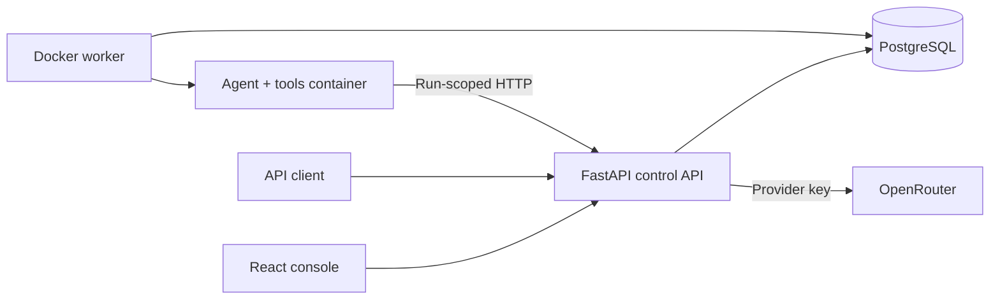

# Agentberth

**Package agents. Bring your model. Deploy an API.**

Agentberth is a local-first agent execution platform. Configure an agent in the console, give it tools, and invoke it through an authenticated HTTP endpoint. Every run executes in a fresh Docker container with a temporary workspace.

**Status: working local preview (v0.1).** Docker is implemented. Kubernetes Jobs, Helm deployment, and VM-backed execution are planned; they are not working deployment options in this release. This is a single-administrator development system, not a production multi-tenant service.

## Quick start

Prerequisites: Docker with Compose v2 or later, running Linux containers. Docker Desktop works on macOS; no local Python, Node, Kubernetes, or model API key is required for the demo. Allow a few minutes for the initial image downloads/build.

After cloning this repository:

```bash
cd agentberth
cp .env.example .env  # skip this if you already configured .env
docker compose up --build -d
```

Open **[localhost:8080](http://localhost:8080)**, select **Harbor guide**, and click **Run agent**. The deterministic demo executes Python and writes `report.md`; it does not call an LLM or interpret arbitrary instructions. Follow the activity stream and download the artifact from the Result tab.

The console uses `agentberth-local` as its default local administration key. If you set a custom `AGENTBERTH_ADMIN_KEY`, enter it in the connection dialog. The service binds to loopback only. See the [security model](docs/security.md) before sharing access.

Stop services without deleting your runs:

```bash
docker compose down
```

`docker compose down -v` also permanently deletes the local database and artifacts. Use it only when you want a full reset.

## Connect a real model

Set these values in your **gitignored** `.env` file:

```dotenv
LLM_BASE_URL=https://openrouter.ai/api/v1
LLM_MODEL=google/gemini-3.8-flash
LLM_API_KEY=your-key-here
```

Apply configuration changes with `docker compose up -d`. In the console, choose **New agent**, select **OpenRouter**, enable the tools you want, and create it. A blank model override uses `LLM_MODEL`. Then try:

> Use Python to calculate the average of 12, 18, and 24. Write a short report to report.md.

Your provider key stays in the API service. Sandboxes receive a short-lived, run-scoped token instead. Agentberth currently supports the OpenRouter chat-completions protocol and requires a model/provider route that supports tool calling when tools are enabled. Model IDs and availability can change; choose another supported model in Configure if needed. Model calls incur provider charges.

## Add a custom tool

The standard package format is `tool.json`, `handler.py`, and `tests.json`. Default tools live under `tools/builtin`; custom tools can be authored through **Tools** in the console or imported from a folder:

```bash
python3 scripts/tools.py import tools/examples/summarize-csv
python3 scripts/tools.py test summarize-csv 1.0.0
python3 scripts/tools.py publish summarize-csv 1.0.0
```

Then add `summarize-csv@1.0.0` under **Tools for this run**, or save it in an agent's defaults. See the [package format and tutorial](docs/tools.md). Sandbox fixture tests need no LLM credits.

## Invoke an endpoint

The default example is available as `harbor-guide`:

```bash
curl -s http://localhost:8080/v1/deployments/harbor-guide/runs \
  -H 'Authorization: Bearer agentberth-local' \
  -H 'Content-Type: application/json' \
  -H 'Idempotency-Key: my-first-run' \
  -d '{"input":"Create a demo report."}'
```

This returns `202 Accepted` with an `id`, `status_url`, and `events_url`. Use the returned run ID:

```bash
curl -N http://localhost:8080/v1/runs/RUN_ID/events \
  -H 'Authorization: Bearer agentberth-local'

curl -s http://localhost:8080/v1/runs/RUN_ID \
  -H 'Authorization: Bearer agentberth-local'
```

Change the key in these examples if you configured your own. See the [API guide](docs/api.md) and the machine-readable [OpenAPI schema](http://localhost:8080/openapi.json).

## What works today

- Agent creation and configuration with stable invocation URLs.
- Configuration version counters and immutable configuration snapshots for accepted runs.
- Docker containers with CPU, memory, process, filesystem, and wall-clock limits.
- Versioned tool registry, repository-based default tools, custom Python packages, and sandbox fixture tests.
- Per-run tool additions/disabling, package import/export, and immutable package snapshots.
- Python execution and UTF-8 file read/write tools.
- Deterministic demo provider and real OpenRouter tool-calling loops.
- Durable run history, resumable server-sent events, and downloadable binary/text artifacts and combined ZIP downloads.
- Model step limits, usage/cost reporting, cancellation, and interrupted-run recovery.
- Locked dependencies, unit tests, Compose integration scripts, and a GitHub Actions workflow.

## Architecture



The API and worker are separate processes. Only the worker mounts the Docker socket. Sandboxes do not receive host mounts, database credentials, or LLM keys. A private sandbox network connects them to the API; the API has a separate outbound network for model calls.

## Documentation

- [Architecture and lifecycle](docs/architecture.md)
- [API reference and examples](docs/api.md)
- [Local development and troubleshooting](docs/development.md)
- [Tool authoring](docs/tools.md)
- [Security model and limitations](docs/security.md)
- [Kubernetes and microVM roadmap](docs/roadmap.md)
- [Local validation record](docs/validation.md)
- [Contributing](CONTRIBUTING.md)

## Verify your installation

The smoke test requires Python 3.10+ on the host and a running Compose stack:

```bash
python3 scripts/smoke.py
```

To additionally test a real model call (uses configured credits):

```bash
python3 scripts/smoke.py --live
```

These tests create clearly named example agents and runs in your local database. Automated CI uses the demo provider and needs no secrets. The fault-injection test in `scripts/resilience.py` also restarts the worker; run it only on a development stack with no important active runs.

## License

[Apache License 2.0](LICENSE).

### Console appearance

The console opens in dark mode by default. Use the sun/moon switch in the top bar to select light mode or return to dark mode. Your choice is saved in this browser and restored on reload.

### File processing

Attach temporary input files or ZIP/TAR archives to a run in the console or API. Archives are automatically extracted in the sandbox. Download generated text/binary files individually or together as ZIP. [File workflow, runnable examples, and GUI/API parity](docs/files.md) explain limits and input expiry.

### Kubernetes

Deploy the same application independently on Kubernetes using the Helm chart and Job execution backend. Docker Compose remains the laptop default. See [Kubernetes installation, DigitalOcean/kind/MicroK8s examples, tests, and operations](docs/kubernetes.md). The cluster deployment has its own database and run history; use local port 8081 for its port-forward while Compose uses 8080.
